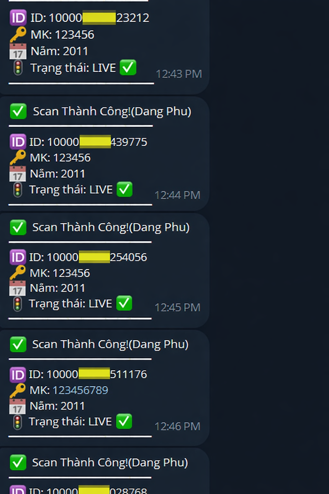

# PTMEDIA - FACEBOOK OLD ACCOUNT TOOL (V3.0)

Welcome to the official repository of **PTMEDIA**, a specialized software solution for Facebook account discovery and recovery. This tool is designed to be efficient, stable, and highly effective for professional digital operations.

---

## 🚀 INTRODUCTION
PTMEDIA V3.0 is a high-speed, multi-threaded tool built specifically for scanning and recovering old Facebook accounts (2004-2024 era). It utilizes modern API methods to ensure stability and high success rates across different environments.

---

## 🔥 KEY FEATURES

- ✅ **Advanced Verification**: High-accuracy status checking without the need for additional clone accounts or bait cookies.
- ✅ **Dual-Method Force**: Supports multiple login protocols to ensure the best results against various security filters.
- ✅ **High-Performance**: Multi-threaded engine for maximum speed and efficiency on both mobile and PC.
- ✅ **Telegram Sync**: Instant notifications for successful results sent directly to your configured Telegram Bot.
- ✅ **Structured Output**: Automatically organizes success hits in a clean `UID | Pass | Year | Status` format in `PTMEDIA-OK.txt`.

---

## 📅 PROOF OF SUCCESS
Below is the real-time result from the PTMEDIA engine. High success rate guaranteed.


---

## 🎮 OPERATING MODES


1.  **OPTION A: AUTO DISCOVERY (SERIES)**
    - Automatically targets UIDs based on specific historical year ranges: **2004-2007**, **2009**, **2010-2014**, and **Mixed Series**.
2.  **OPTION B: CRACK FROM FILE UID**
    - Import your own custom `.txt` list of UIDs for a targeted scan operation.

---

## 📖 HOW TO USE

Follow these steps for the best experience:

- **STEP 1**: Ensure your device has **Python 3.13** installed.
- **STEP 2**: Activate **CLOUDFLARE 1.1.1.1 VPN** before running the tool (Mandatory for both Windows & Android to bypass IP blocks).
- **STEP 3**: Open the **(A) SETTINGS** menu if you want to use Telegram (Optional). Enter your Token and Chat ID.

- **STEP 4**: Select **(B) START SCAN** from the main menu.
- **STEP 5**: Choose your scanning mode and attack method.
- **STEP 6**: Monitor the console or your Telegram bot for update results.

---

## 📥 INSTALLATION GUIDE

### For Android (Termux)
- Recommended: **Python 3.13**
```bash
pkg update && pkg upgrade -y
pkg install python git -y

git clone https://github.com/Phamtienmedia/PTMEDIA-OLD-FB
cd PTMEDIA-OLD-FB
pip install requests beautifulsoup4 urllib3
python scan.py
```

### For Windows
1.  **Install Python**: Download and install **Python 3.13** from [Python.org](https://www.python.org/).
2.  **VPN**: Install and activate **Cloudflare 1.1.1.1** for Windows (Mandatory).
3.  **Download Tool**:

    ```powershell
    git clone https://github.com/Phamtienmedia/PTMEDIA-OLD-FB
    cd PTMEDIA-OLD-FB
    ```
3.  **Setup Environment**:
    ```powershell
    pip install requests beautifulsoup4 urllib3
    ```
4.  **Launch**:
    ```powershell
    python scan.py
    ```

---

## ⚠️ IMPORTANT NOTE

> **YOU MUST USE CLOUDFLARE 1.1.1.1 VPN.**  
> Without the VPN, the tool will not produce any results as Facebook blocks repeated login attempts from a single IP address.

---

## 🌟 COMMITMENT & SUPPORT

- 🎁 **FREE TRIAL**: Contact the Admin to get a free test session.
- 👤 **Developer**: Phạm Xuân Tiến (PTMEDIA)
- ✈️ **Telegram**: [https://t.me/PTMEDIA2](https://t.me/PTMEDIA2)
- 💬 **WhatsApp**: +84877667153

---
**PTMEDIA TOOL — Professional Solution for Digital Operations.**
